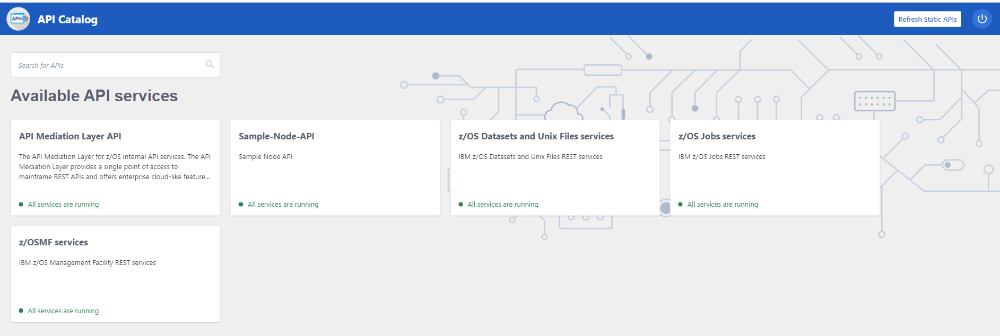
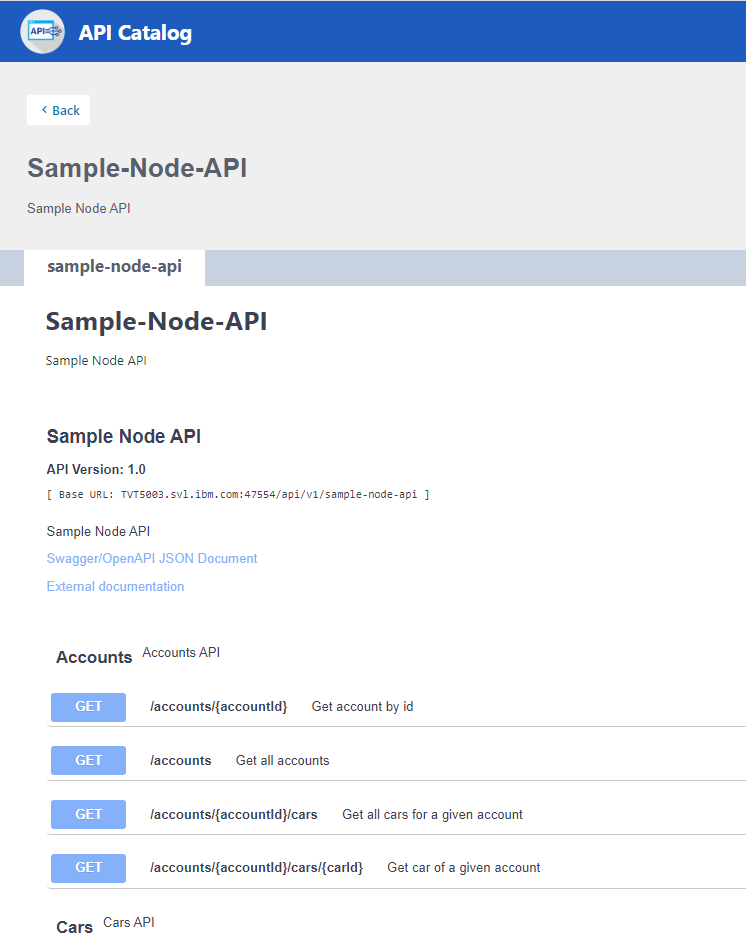
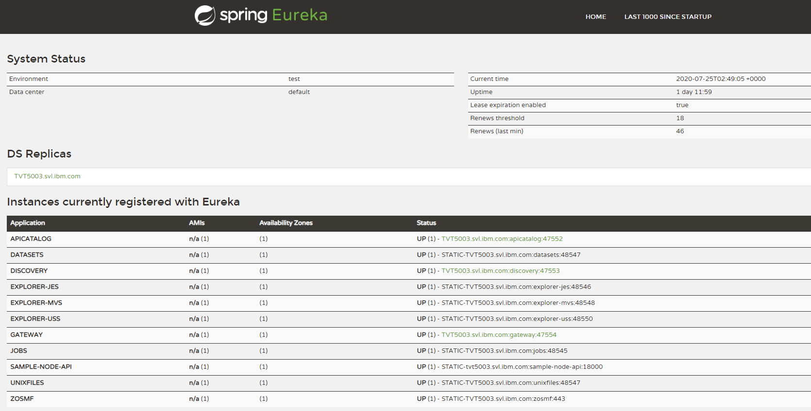

# sample-node-api  
A sample node js api for finding cars and accounts for a dealership,its used here to demonstrate the steps to extend API/ML with your own rest api.     

## Steps

**Note**  
`Only rest api with https support can be deployed behind API/ML, make sure to enable https support in your rest api.
`   
This sample express app, has https enabled already.    

## PART I: Download & Build on local

## Method 1: From github
### 1) Clone the repository, install node packages  and verify routes locally

``` 
//on local
git clone https://github.com/zowe/sample-node-api
cd sample-node-api
npm install
npm start
```

Open your local browser and try accessing     
`https://localhost:18000/accounts/`   
`https://localhost:18000/accounts/1`   
`https://localhost:18000/accounts/1/cars/`   


### 2) Transfer project files from local to remote host

**Note**  
Don't transfer `node_modules` folder, we can do install npm install later on remote server itself to pull down required node packages

```
cd sample-node-api
npm run build
scp -r dist ibmuser@my.mainframe.com:</usr/lpp/extender>/sample-node-api
```

## Method 2: From Artifactory
### 1) Download latest pax from artifactory
Get latest package from [artifactory](https://zowe.jfrog.io/zowe/webapp/#/artifacts/browse/tree/General/libs-snapshot-local/org/zowe/sample-node-api/1.0.0-SNAPSHOT)

Copy latest pax url and use curl to download:
```
# on local or directly on z/OS
curl -O https://zowe.jfrog.io/zowe/libs-snapshot-local/org/zowe/sample-node-api/1.0.0-SNAPSHOT/sample-node-api-1.0.0-snapshot-1-20200903170045.pax
```

### 2) Transfer and unpax on z/OS
```
# From local - if downloaded on z/OS skip this
sftp ibmuser@mymainframe.ibm.com
put <pax-name>.pax
```


## PART II: Deploy with Zowe on server

### 1) login
```  
ssh ibmuser@my.mainframe.com       
```

### 2) install component using zowe-install-component.sh script
```

./<zowe-runtime-dir>/bin/zowe-install-component.sh -d <zowe-extensions-dir> -i <zowe-instance-dir> -o <component-pax-file> -l <log-folder>

```

### 3) Lifecycle scripts of the component

We expect following in service folder `start.sh`.
In our case its bin folder with relevant scripts.

`start.sh` starts node app on configured port       
`env.sh` its custom script use to configure port for our node app, feel free to use your desired way         

### 4) Access newly deployed webservice

Please see static definition file `sample-node-api.yml`      
It configures service endpoint as `sample-node-api` with property `serviceId`     
We also provide api gateway base path `api\v1` with property `gatewayUrl` in same file.        


In effect, service can be accessed with following url:      
`https://{host}:{GATEWAY_PORT}/{gatewayUrl}/{serviceId}/*`    

where `GATEWAY_PORT` is configured in $INSTANCE_DIR/instance.env      

Verify by accessing following:      
`https://my.mainframe.com:7554/api/v1/sample-node-api/accounts/`            
`https://my.mainframe.com:7554/api/v1/sample-node-api/accounts/1/`            
`https://my.mainframe.com:7554/api/v1/sample-node-api/accounts/1/cars/`              

### 5) Registered With API Catalog

**API Catalog**




**Discovery Service Dashboard**

